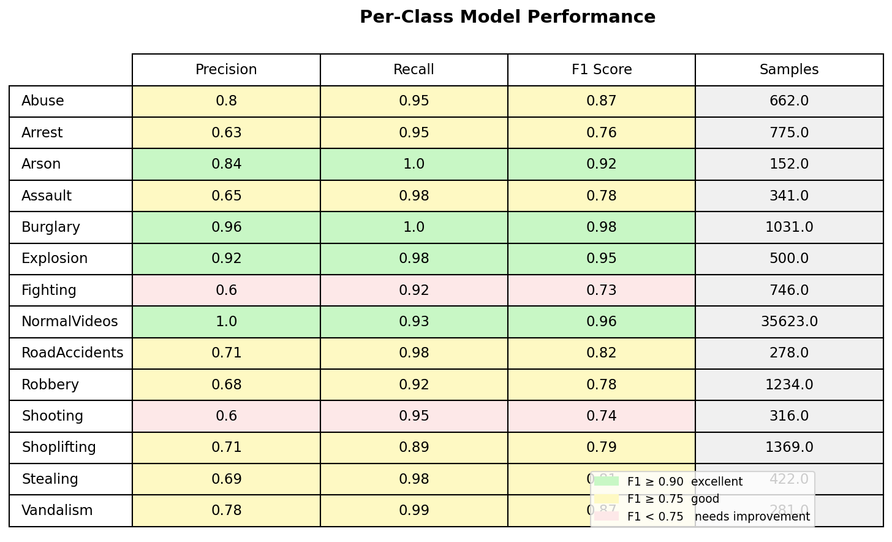
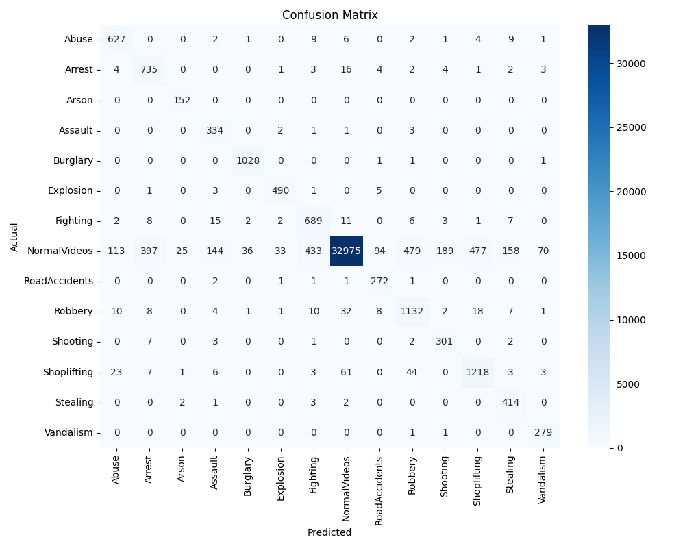

# Surveillance Activity Detection

Real-time suspicious activity detection in surveillance videos using YOLOv8 pose estimation and LSTM neural network. Built to help identify suspicious activities in public surveillance footage.

**93% accuracy across 14 activity classes on the UCF-Crime benchmark dataset.**

---

## Demo

<div align="center">


</div>

---

## What It Does

Analyzes surveillance video frame by frame, detects people using pose estimation, and classifies what they are doing. Triggers alerts when suspicious activity is detected above a confidence threshold.

Two layers of detection:

- **LSTM classifier** — identifies known suspicious activities (Fighting, Robbery, Assault etc.)
- **Autoencoder** — flags unusual behavior that does not match normal movement patterns, even if never seen during training

---

## How It Works

```
Video Frame
    ↓
YOLOv8-pose — detects people, extracts 17 body keypoints per frame
    ↓
30 frames stacked as a sequence
    ↓
Normalize keypoints to [0,1] — removes position bias
    ↓
LSTM — learns movement patterns over time → activity label + confidence
    ↓
Autoencoder — compares to normal behavior → anomaly score
    ↓
Alert if confidence > threshold OR anomaly score > threshold
```

**Why keypoints instead of raw pixels?**

A raw video frame is ~6 million numbers. Keypoints reduce that to 34 numbers per frame — 180,000x smaller — while keeping all the body movement information that matters for activity detection. This makes the model fast enough to run on a laptop in real time.

**Why LSTM?**

A single frame tells you nothing — a person with raised arms could be celebrating or being robbed. LSTM looks at 30 frames together and learns patterns over time. Rapid chaotic arm movement over 30 frames means fighting. Slow deliberate movement means walking. The temporal context is everything.

**Why Autoencoder?**

The LSTM only knows 14 classes it was trained on. If someone does something completely new — crawling, unusual crowd stampede, unknown threat — the LSTM will guess wrong. The autoencoder was trained only on normal behavior. Anything that does not look normal produces a high reconstruction error and triggers an alert, even if the LSTM has never seen it before.

---

## Results

| Metric | Score |
|--------|-------|
| Overall Accuracy | 93% |
| Weighted F1 Score | 93% |
| Best Class (Burglary) | 98% F1 |
| Training Time | 23 min on M1 Pro |
| Dataset | UCF-Crime, 218k sequences |
| Classes | 14 activity classes |





---

## Activity Classes

14 classes from the UCF-Crime dataset:

`Abuse` `Arrest` `Arson` `Assault` `Burglary` `Explosion` `Fighting` `Normal` `RoadAccidents` `Robbery` `Shooting` `Shoplifting` `Stealing` `Vandalism`

---

## Setup

Requirements: Python 3.11, conda

```bash
# clone repo
git clone https://github.com/mhd-faizzan/surveillance-pipeline.git
cd surveillance-pipeline

# create environment
conda create -n surveillance python=3.11
conda activate surveillance

# install dependencies
pip install -r requirements.txt
```

---

## Run the Dashboard

```bash
streamlit run app.py
```

Upload any surveillance video. The model will analyze it and show:

- Activity label and confidence score on each frame
- Anomaly score from the autoencoder
- Alert log of all detected suspicious activities

Trained models are included in the repo — no additional download needed.

---

## Train Your Own Model

**Step 1 — Extract keypoints**

The dataset has 670k+ frames. Running keypoint extraction locally takes 10+ hours. Instead use Kaggle's free T4 GPU which completes it in 2-3 hours.

See [kaggle/README.md](kaggle/README.md) for step by step instructions including how to get free GPU access.

**Step 2 — Place keypoints CSV**

After Kaggle finishes, download `keypoints.csv` and place it at:

```
data/processed/keypoints.csv
```

**Step 3 — Train locally**

```bash
python main.py
```

Trains LSTM and autoencoder on M1 Pro in ~25 minutes. All hyperparameters can be adjusted in `configs/config.yaml`.

---

## Configuration

All settings live in `configs/config.yaml`. Key parameters:

```yaml
features:
  sequence_length: 30      # frames per sequence
  input_size: 34           # 17 keypoints x 2 coords

model:
  lstm:
    hidden_size: 128
    num_layers: 2
    epochs: 50
    batch_size: 64

inference:
  confidence_alert_threshold: 0.85   # alert above this
  temporal_smoothing_frames: 10      # smoothing window
```

---

## Dataset

UCF-Crime — 1,900 real-world surveillance videos across 13 anomaly classes plus normal activity. Frames are pre-extracted at 64x64 resolution.

Download: [kaggle.com/datasets/odins0n/ucf-crime-dataset](https://www.kaggle.com/datasets/odins0n/ucf-crime-dataset)

---

## Tech Stack

| Tool | Purpose |
|------|---------|
| YOLOv8-pose | Person detection and keypoint extraction |
| PyTorch | LSTM and autoencoder training |
| Streamlit | Interactive dashboard |
| OpenCV | Video processing |
| Apple MPS | M1 GPU acceleration |
| Kaggle T4 | Keypoint extraction (free) |

---

## Project Structure

```
surveillance-pipeline/
├── src/
│   ├── data/
│   │   └── extract_keypoints.py    # YOLOv8-pose keypoint extraction
│   ├── features/
│   │   ├── normalize_keypoints.py  # scale keypoints to [0,1]
│   │   └── build_sequences.py      # sliding window sequences for LSTM
│   └── models/
│       ├── lstm_classifier.py      # LSTM model definition
│       ├── autoencoder.py          # anomaly detection model
│       ├── train.py                # training loop with early stopping
│       ├── evaluate.py             # metrics and confusion matrix
│       └── results_summary.py      # per-class performance table
├── configs/
│   └── config.yaml                 # all hyperparameters and paths
├── kaggle/
│   └── README.md                   # keypoint extraction on Kaggle
├── assets/
│   ├── demo1.gif                   # dashboard demo
│   ├── demo2.gif                   # alert detection demo
│   └── results/                    # confusion matrix, performance table
├── models/
│   ├── lstm_classifier.pt          # trained LSTM (93% accuracy)
│   └── autoencoder.pt              # trained anomaly detector
├── app.py                          # Streamlit dashboard
├── main.py                         # training entry point
└── requirements.txt
```

---

## Why This Architecture

Most activity recognition approaches run CNNs directly on video frames — computationally expensive and hard to deploy on real hardware. This project uses a lightweight pipeline:

- Extract keypoints once as a preprocessing step
- Train LSTM on 34 numbers per frame instead of millions of pixels
- Run inference in real time on a laptop
- Add anomaly detection for unknown threats without retraining the main model

This makes it practical for real deployment on edge hardware like surveillance cameras with limited compute.

---

## Limitations

- Trained on 64x64 surveillance footage — performance may vary on higher resolution or different camera angles
- Fighting and Assault classes overlap visually — both involve rapid arm movement
- Normal class has 10x more samples than other classes — handled with weighted loss during training

---

## Kaggle Notebook

Full keypoint extraction pipeline:
[kaggle.com/code/faizzzan/surveillance-pipeline](https://www.kaggle.com/code/faizzzan/surveillance-pipeline)